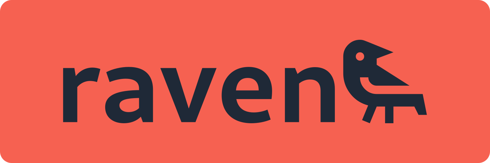

# raven


## Description
Raven is a local application that helps you find scientific papers related to your research. It comes with a simple web interface that allows you to search and collect papers from various sources. On top of that, it provides an easy way to generate embeddings that can be used for similarity searches. Use a single `config.json` file to configure the application from your API keys to the embedding models you want to use.

## Getting Started
To install the application, you have several options:

### Docker
Before giving you the instructions, let's describe what kind of setup we have for the Docker image. We use the `nvidia/cuda` image that is built on top of the `ubuntu:24.04` image. The CUDA version that comes installed is 12+. After installing python3.12, we copy the necessary files to run the application and install the required dependencies.

Start by building the docker image via:
```
docker buildx build -t raven .
```

Once the image is built, we need to pass our `config.json` to the container and run it. Also, set the address to `0.0.0.0:8000` to access the application from outside the container. Run the following command to start the container:
```
docker run -v $(pwd)/config.json:/config.json -p 8000:8000 --gpus=all -ti raven --bind=0.0.0.0:8000
```

Go inside the container for installing additional dependencies:
```
docker exec -it <container_id> /bin/bash
```

### Manual Installation
Before you start, make sure you have the following dependencies installed on your system:
- Python 3.12 or higher
- cuda

Start by cloning the repository and then navigate to the project directory:
```
git clone https://github.com/kaangiray26/raven
```

Then, navigate to the project directory:
```
cd raven
```

Create a virtual environment and install the required dependencies:
```
python3 -m venv env
env/bin/pip3 install --upgrade pip
env/bin/pip3 install -r requirements.txt
env/bin/python3 -m spacy download en_core_web_sm
```

Before running the application, you need to configure your `config.json`. There is a sample [default-config.json](lib/extra/default-config.json) file that you can use as a template. Copy this file to the root directory and rename it to `config.json`. Then, update the file according to your needs. The `default-config.json` file contains some additional information about the configuration options.

Finally, you can start the application by running the following command:
```
env/bin/python3 app.py
```

This will start the web server on `http://127.0.0.1:8000`. Access the application by opening it in your browser.

## resources
* [Quart](https://quart.palletsprojects.com/en/latest/)
* [tiktoken](https://github.com/openai/tiktoken)
* [OpenAI Usage](https://platform.openai.com/usage)
* [spacy optimization](https://stackoverflow.com/questions/74181750/a-checklist-for-spacy-optimization)
* [spacy optimization](https://github.com/explosion/spaCy/discussions/8402)